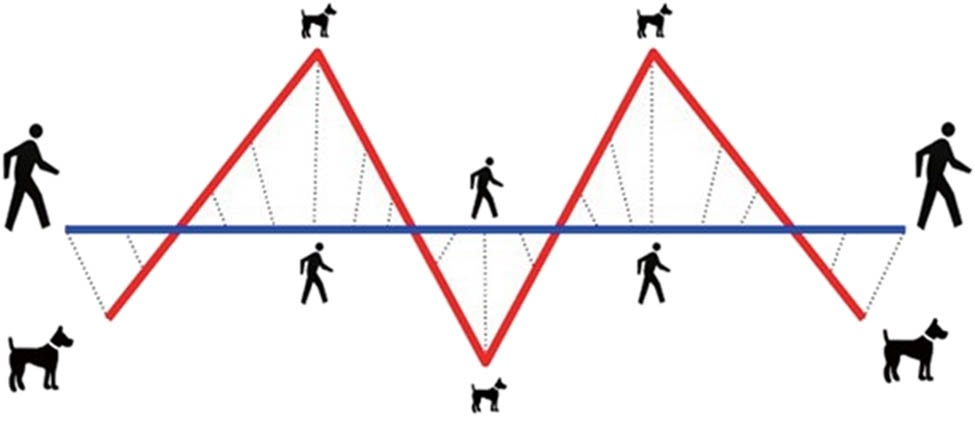

# frechet
[](https://github.com/shanghuiyang/frechet/actions/workflows/CI.yml)
[](https://github.com/shanghuiyang/frechet/blob/main/LICENSE)

frechet implements [Frechet Distance](https://en.wikipedia.org/wiki/Fr%C3%A9chet_distance) algorithm using golang.

## Usage
```
package main

import (
	"fmt"
	"math"

	"github.com/shanghuiyang/frechet"
)

func dist(x, y interface{}) float64 {
	xx, ok := x.(int)
	if !ok {
		return 0
	}
	yy, ok := y.(int)
	if !ok {
		return 0
	}
	return math.Abs(float64(xx - yy))
}

func main() {
	s := []int{1, 3, 5}
	t := []int{2, 4, 6}

	d, err := frechet.Distance(s, t, dist)
	if err != nil {
		fmt.Printf("error: %v\n", err)
		return
	}

	fmt.Printf("frechet distance: %v\n", d)
}
```
